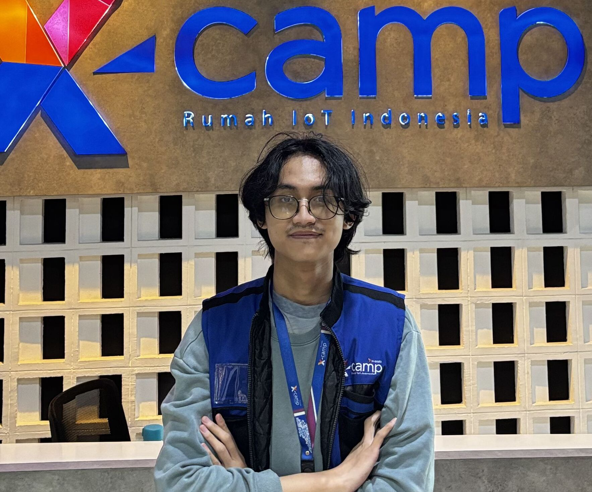

Edrico.

Bio
Experience
Projects
Education

🌓

# Edrico Septian Elyazar

(He/Him)

## AI/ML Engineer

Mathematics @ ITS

✉
[GH](https://github.com/Edriczz "GitHub")
[IN](https://linkedin.com/in/edricose "LinkedIn")

[Download CV](cv_latex/cv.pdf)

### Professional Summary

I am an AI/ML Engineer and Mathematics undergraduate at Institut Teknologi Sepuluh Nopember
(ITS). My technical foundation lies at the intersection of quantitative analysis, computer
vision (PyTorch, TensorFlow), and IoT architecture.

Recently, I engineered Edge AI solutions and automated tracking systems during my internship at
PT XLSmart Telecom Sejahtera. Academically, my thesis focuses on applying Pontryagin's Maximum
Principle for the dynamic optimization and economic analysis of bioethanol production. I am
passionate about bridging the gap between mathematical logic, software engineering, and physical
hardware deployment using real-time protocols like MQTT.

### Certifications

#### Google Data Analytics Professional Certificate

Coursera

[Verify Credential →](https://www.coursera.org/account/accomplishments/professional-cert/certificate/V0X92BL0CM9Y)

#### Intro to Machine Learning

Kaggle

[Verify Credential →](https://www.kaggle.com/learn/certification/edricoseptianelyazar/intro-to-machine-learning)

### Experience

#### AI/ML Engineer Jul 2025 – Dec 2025

PT XLSmart Telecom Sejahtera • Internship

* **FRMS Development:** Engineered the AI Engine for a Face Recognition
  Management System (~83% confidence) using FaceNet and Docker. Optimized for
  high-angle RTSP streams, implementing **MQTT** to transfer real-time
  verification data that seamlessly triggers the automatic door unlock system.
* **Edge AI Optimization:** Migrated a PPE detection model from
  SSD-MobileNet (**TensorFlow**) to YOLO (**PyTorch**) on
  NVIDIA Jetson Nano. Leveraged TensorRT and engineered a custom frame-skipping
  algorithm to maintain 60 FPS on constrained hardware.
* **ReID Tracking:** Utilized Python multiprocessing to implement Person
  Re-identification across non-overlapping camera views.

PyTorchTensorFlowComputer VisionYOLOMQTTTensorRTDockerPython

#### President Dec 2023 – Dec 2024

UKM Bridge ITS • Contract

* Led recruitment resulting in 200+ new member sign-ups and supervised competitive
  events yielding 10+ new athletes and 4 medals.
* Achieved >94% Organizational Accomplishments, securing 2nd place for Most
  Outstanding Sports Unit at ITS (Rektor UGM Cup).
* Executed benchmarking networking with regional groups including Airlangga Bridge
  Club.

LeadershipStrategic Planning

### Featured Projects & Research

#### Identity-Based ReID System

Engineered an advanced tracking system bypassing standard facial limitations. Utilized a
whole-body recognition approach to maintain consistent identity tracking across frames.

Computer VisionPyTorchPython

#### Quantitative Financial Data Pipeline

Engineered an automated data extraction pipeline utilizing the Yahoo Finance API to
aggregate, clean, and structure historical stock market data for quantitative modeling
and economic analysis.

Data EngineeringPythonPandasQuantitative Finance

#### Bioethanol Dynamic Optimization

Mathematical modeling utilizing Pontryagin's Maximum Principle to optimize the economic
output and production processes of bioethanol systems.

MathematicsDifferential EquationsQuantitative

#### Local IoT MQTT Broker

Configured a local Mosquitto broker network to handle lightweight, real-time message
brokering for complex physical hardware trigger events.

MQTTMosquittoLinux

### Education

#### Undergraduate Degree, Mathematics 2022 – Present

Institut Teknologi Sepuluh Nopember (ITS)

**Thesis Focus:** Dynamic optimization and economic analysis of bioethanol
production using Pontryagin's Maximum Principle.

**Relevant Topics:** Quantitative Analysis, Differential Equations,
Physics-Informed Neural Networks (PINNs).
